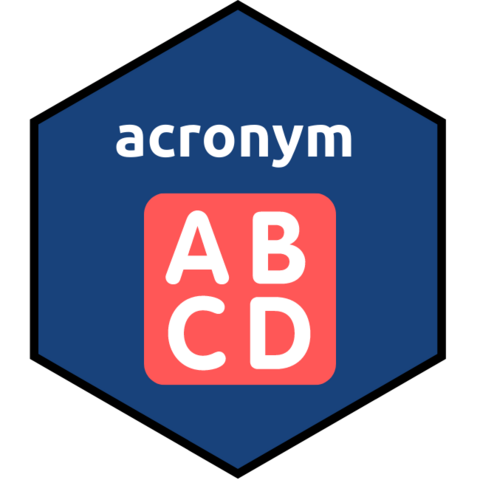

<!-- README.md is generated from README.Rmd. Please edit that file -->

```{r, include = FALSE}
knitr::opts_chunk$set(
  collapse = TRUE,
  comment = "#>",
  fig.path = "man/figures/README-",
  out.width = "100%"
)
```

# acronym 

<!-- badges: start -->
[](https://www.tidyverse.org/lifecycle/#experimental)
[](https://CRAN.R-project.org/package=acronym)
<!-- badges: end -->

The goal of `acronym` is to help finding acronyms in a Word document so you can create a list of abbreviations for your manuscript submission.

## Installation

You can install the development version of `acronym` from [GitHub](https://github.com/fmmattioni/acronym) with:

``` r
# install.packages("remotes")
remotes::install_github("fmmattioni/acronym")
```

## Example

```{r}
library(acronym)

find_acronyms(path = system.file("zotero.docx", package = "acronym"), ref_manager = "zotero")
```

### Copy it directly into your Word document!

```{r}
knitr::include_graphics("man/figures/demo.gif")
```

Got any ideas and/or tips for improving the code? Feel free to open an issue or submit a PR!

## Code of Conduct

Please note that the acronym project is released with a [Contributor Code of Conduct](https://contributor-covenant.org/version/2/0/CODE_OF_CONDUCT.html). By contributing to this project, you agree to abide by its terms.
