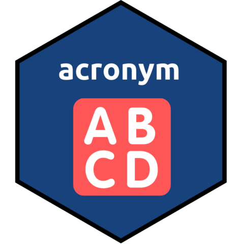

<!-- README.md is generated from README.Rmd. Please edit that file -->

# acronym 

<!-- badges: start -->

[](https://www.tidyverse.org/lifecycle/#experimental)
[](https://CRAN.R-project.org/package=acronym)
[](https://github.com/fmmattioni/acronym/actions)
<!-- badges: end -->

The goal of `acronym` is to help finding acronyms in a Word document so
you can create a list of abbreviations for your manuscript submission.

## Installation

You can install the development version of `acronym` from
[GitHub](https://github.com/fmmattioni/acronym) with:

``` r
# install.packages("remotes")
remotes::install_github("fmmattioni/acronym")
```

## Example

``` r
library(acronym)

find_acronyms(path = system.file("zotero.docx", package = "acronym"), ref_manager = "zotero")
#> ✓ List of acronyms copied to clipboard. You can now just paste it into your Word document.
#>  [1] "CCC"      "CP"       "CP1/time" "CP2-hyp"  "CP3-hyp"  "CPexp"   
#>  [7] "CPlinear" "HR"       "LOOCV"    "Pmax"     "POpeak"   "TTE"     
#> [13] "V̇O2max"   "W’"
```

### Copy it directly into your Word document\!

``` r
knitr::include_graphics("man/figures/demo.gif")
```


## The way it works

`acronym` is going to search only for acronyms in your manuscript that
are between brackets. Please, note that this is still experimental, so
ultimately you should double-check the list of abbreviations retrieved.
Got any ideas and/or tips for improving the code? Feel free to open an
issue or submit a PR\!

## Code of Conduct

Please note that the acronym project is released with a [Contributor
Code of
Conduct](https://contributor-covenant.org/version/2/0/CODE_OF_CONDUCT.html).
By contributing to this project, you agree to abide by its terms.
